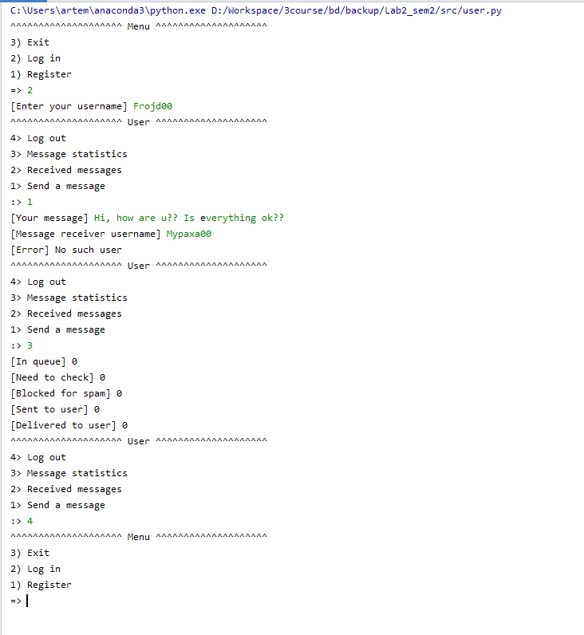

# Лабораторна робота No 2. Практика використання серверу Redis

## Завдання 
[Лабораторна робота № 2](http://scs.kpi.ua/sites/default/files/lab2_bd2-db2019_2020.pdf)

## Обгрунтування вибору сруктур даних:

Користувачі - множина так як важлива швидкість.

Повідомлення зберігаються в хештаблиці, ще дозволє легко отримувати повідомлення які відправили користувачі за ключем.
Ключ - message_id, Значення - структура (текст, id відправника, id отримувача, статус)

Черга повідомлень - List, оскільки зберігає порядок та має достатню швидкодію.

## Робота програми

